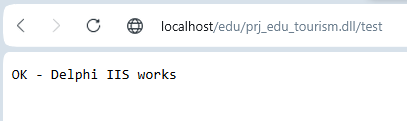
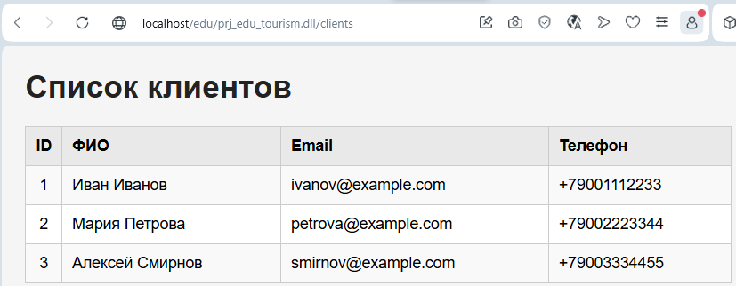
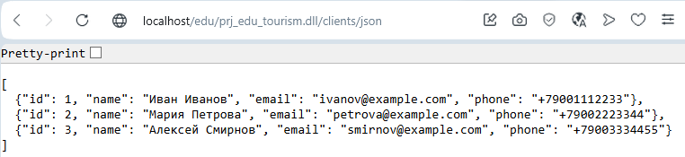
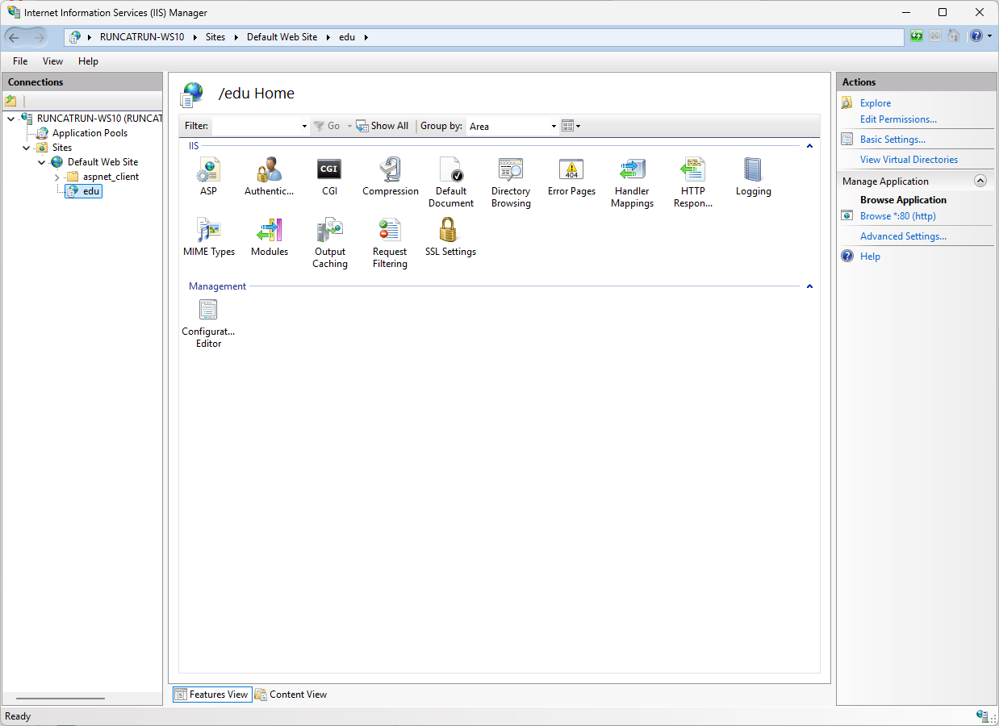
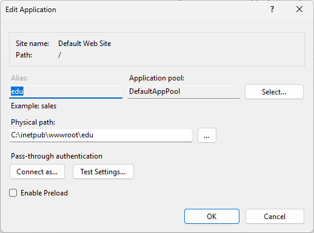

# Delphi Web Application (IIS + MS SQL Server)

## Описание
Учебное WEB-приложение, разработанное на Delphi 13.1 с использованием технологии WebBroker (ISAPI) и развернутое на IIS.

Приложение взаимодействует с базой данных MS SQL Server и демонстрирует работу с HTTP-запросами.

---

## Используемые технологии

- Delphi 13.1 (RAD Studio)
- WebBroker (ISAPI DLL)
- Microsoft IIS
- MS SQL Server
- FireDAC
- ODBC Driver 18

---

## Доступные endpoints

### Проверка работы
/test

### HTML таблица клиентов
/clients

### JSON API
/clients/json

---

## База данных

Используется база данных:
WebPracticeDB

Таблица:
- Clients

---

## Готовый бинарник

В папке `/release` находится собранная версия:
prj_edu_tourism.dll

Её можно использовать без сборки проекта.

---

## Тестовые данные

В SQL-скрипт включены тестовые записи таблицы `Clients`, используемые для проверки работы endpoints `/clients` и `/clients/json`.

---

## Запуск

1. Установить IIS
2. Установить SQL Server
3. Выполнить SQL-скрипт `db/WebPracticeDB.sql`
4. Скопировать DLL в:
   C:\inetpub\wwwroot\edu\
5. Открыть в браузере:
/test

---

## Доступ к базе данных

Для работы приложения используется SQL-пользователь:
- Login: webuser
- Password: WebUser123!

Важно!
SQL Server должен быть настроен в режиме:
"SQL Server and Windows Authentication mode"

---

## Снимки экрана

### Проверка работы приложения

Отображение тестового endpoint `/test`, подтверждающего корректную работу ISAPI-приложения в IIS.

---

### Отображение клиентов (HTML)

Вывод данных из базы в виде HTML-таблицы по адресу `/clients`.

---

### JSON API

Ответ сервера в формате JSON по endpoint `/clients/json`.

---

### Содержимое базы данных (SSMS)
.png)
Данные таблиц базы WebPracticeDB в SQL Server Management Studio.

---

### Настройка IIS (приложение edu)

Создание и настройка приложения `edu` в IIS.

Конфигурация параметров приложения и привязка к каталогу.

---

## Архитектура

Приложение реализует трехуровневую архитектуру:

- Presentation Layer — браузер
- Application Layer — Delphi (WebBroker)
- Data Layer — MS SQL Server

---

## Возможности развития

- добавление CRUD операций
- расширение REST API
- подключение frontend (React/Vue)
- переход к микросервисной архитектуре

---

## Назначение

Проект выполнен в рамках учебной практики по направлению:
"Прикладная информатика (ИИ и базы данных)"